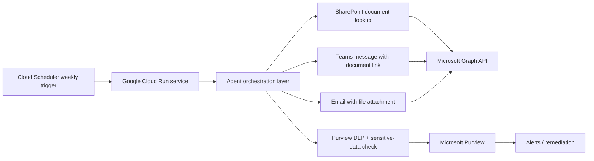

# GCP Agent Framework for Microsoft 365 + Purview Automation

This repository contains a beginner-friendly, copy-pasteable framework for a GCP-hosted Python agent that:

- finds a document in SharePoint,
- checks it for sensitive material and DLP policy concerns,
- sends a Teams message with the document or document link,
- sends an email with the file attached,
- runs on a weekly schedule through GCP Cloud Scheduler and Cloud Run,
- uses Microsoft Entra ID registration and Microsoft Purview integration patterns from the Microsoft Agent Framework guidance.

The intent is to provide a practical starter template rather than a locked production implementation. Replace the sample IDs, file paths, and email/Teams destinations with your own tenant values.

## Repo structure

- `src/weekly_sharepoint_alert_agent.py` — main Python workflow
- `app.py` — Cloud Run entry point
- `deploy/cloud-run.yaml` — sample deployment manifest
- `scripts/register_entra_app.sh` — Entra app registration helper
- `scripts/generate_a365_blueprint.py` — blueprint generator
- `docs/agent-architecture-map.md` — architecture diagram and concept map
- `.env.example` — variable template
- `requirements.txt` — Python dependencies

## Architecture map

See `docs/agent-architecture-map.md` for the diagram.



## What the agent does

1. Reads configuration values from environment variables.
2. Uses Microsoft Graph to fetch a document from SharePoint.
3. Evaluates the content for likely sensitive markers and DLP-related signals.
4. Sends a Teams message with the SharePoint document link or attachment.
5. Sends an email with the document attached.
6. Logs the results and leaves a clear place for future policy enforcement or alerting.

## Why this follows the Microsoft Agent Framework guidance

The sample reflects the Microsoft-recommended pattern for integrating Microsoft Purview policy middleware into an Agent Framework flow. The Microsoft docs describe how to add Purview middleware to an agent so that prompts and responses are checked against DLP and sensitive-information policies.

Relevant references:

- Microsoft Learn: `Microsoft Purview | Microsoft Learn`
- Microsoft Agent Framework sample: `python/samples/05-end-to-end/purview_agent`
- Python package: `agent-framework-purview`

## Beginner setup instructions

### 1. Install prerequisites

On your laptop or workstation:

```bash
python -m venv .venv
source .venv/bin/activate
pip install -r requirements.txt
```

If you are on Windows PowerShell:

```powershell
python -m venv .venv
.\.venv\Scripts\Activate.ps1
pip install -r requirements.txt
```

### 2. Create your Microsoft Entra app

You can do this with Azure CLI:

```bash
bash ./scripts/register_entra_app.sh
```

Then add these Microsoft Graph permissions in the Entra app and grant admin consent:

- Files.Read.All
- Sites.Read.All
- Mail.Send
- ChannelMessage.Send
- TeamworkAppInstallation.ReadWriteForTeam.All
- SecurityEvents.Read.All
- User.Read

The app registration should be tied to your tenant and used as the principal for the Graph calls made by the agent.

### 3. Fill in the environment values

Copy `.env.example` to a new file named `.env` and replace the placeholder values:

```bash
cp .env.example .env
```

Then edit `.env` with your tenant, app IDs, SharePoint site ID, file path, Teams IDs, and email addresses.

Important values to update:

- `TENANT_ID`
- `CLIENT_ID`
- `CLIENT_SECRET`
- `SHAREPOINT_SITE_ID`
- `SHAREPOINT_SITE_URL`
- `SHAREPOINT_FILE_PATH`
- `TEAMS_TEAM_ID`
- `TEAMS_CHANNEL_ID`
- `EMAIL_TO`
- `EMAIL_FROM`
- `PURVIEW_CLIENT_APP_ID`

### 4. Test locally

Run the app in local mode:

```bash
python app.py
```

Then call the endpoint:

```bash
curl -X POST http://localhost:8080/run
```

If the workflow succeeds, the app will try to:

- download the SharePoint file,
- check the content for sensitive markers,
- send the Teams notification,
- send the email with the attachment,
- fetch Microsoft 365 security alerts.

### 5. Deploy to GCP Cloud Run

1. Create a Google Cloud project and enable Cloud Run and Cloud Scheduler.
2. Build the container image:

```bash
gcloud builds submit --tag gcr.io/<PROJECT_ID>/weekly-sharepoint-agent .
```

3. Deploy the service:

```bash
gcloud run deploy weekly-sharepoint-agent \
  --image gcr.io/<PROJECT_ID>/weekly-sharepoint-agent \
  --platform managed \
  --region us-central1 \
  --allow-unauthenticated
```

4. Update the environment variables in Cloud Run or use Secret Manager.
5. Configure Cloud Scheduler to trigger `https://<your-service-url>/run` once per week.

Example cron:

```bash
0 9 * * 1
```

This means 9:00 AM every Monday. Replace with your preferred time.

## Purview and sensitive-data monitoring patterns

This repo intentionally follows a pattern that is straightforward to extend for real DLP monitoring in Microsoft Purview:

- Add the Purview middleware to the agent in the Agent Framework layer.
- Register the app as an approved AI app location in Purview.
- Review security alerts and DLP-related items that are generated from the interactions.
- Log the alert context and route it to a security operation or workflow.

The sample code includes a `PurviewDlpMonitor` wrapper that checks for common sensitive markers and calls the Microsoft Graph security alerts endpoint.

This approach is a practical starter pattern for enterprise security scenarios without forcing a single implementation that may not fit your exact tenant configuration.

## A365 SDK / CLI blueprint

The repo ships with a simple blueprint generator:

```bash
python scripts/generate_a365_blueprint.py
```

This creates a JSON blueprint in the `generated/` folder.

## Copy-paste skeleton

If you want the minimum useful version, the following snippet is the key idea:

```python
from src.weekly_sharepoint_alert_agent import run_weekly_workflow

result = run_weekly_workflow()
print(result)
```

## Notes and cautions

- You must replace all placeholder IDs and URLs before running for real.
- Graph permission consent is required in the tenant.
- The `send_teams_message_with_document` and `send_email_with_document` calls are examples of how to attach or reference the file; you may need to adapt to your tenant's exact file/Teams channel structure.
- The actual DLP enforcement depends on your Purview policies and the app registration state in Entra ID.
- This is intended to be a framework and starter sample, not a fully hardened enterprise workflow.

## Next steps

- Add real content inspection for PDFs, Office documents, or images.
- Store results in BigQuery or Cloud Logging for long-term tracking.
- Add retry logic and dead-letter handling for transient Microsoft Graph failures.
- Tie the workflow into a dedicated alerting workflow based on Purview or Microsoft Defender signals.

## Useful references

- https://learn.microsoft.com/en-us/agent-framework/integrations/by-component/middleware/purview
- https://github.com/microsoft/agent-framework/tree/main/python/samples/05-end-to-end/purview_agent
- https://pypi.org/project/agent-framework-purview/
- https://learn.microsoft.com/en-us/graph/overview
