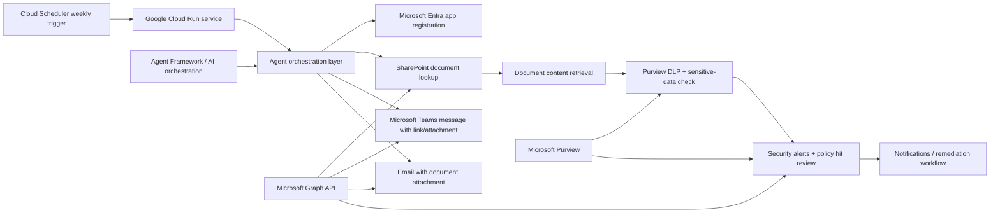

# Agent Architecture Map

## Component descriptions

- Cloud Scheduler: triggers the workflow once per week.
- Cloud Run: hosts the Python agent runtime in GCP.
- Agent orchestration: coordinates the SharePoint access, Teams, email, and monitoring workflow.
- Microsoft Graph: used for SharePoint file access, Teams messages, email delivery, and security alerts.
- Microsoft Purview: evaluates DLP and sensitive content conditions.
- Entra app registration: provides authentication for the agent's delegated API access.

## Recommended Azure + GCP pattern

- Run the agent in Google Cloud Run for scheduling and lightweight automation.
- Use Microsoft Entra ID for app registration and OAuth.
- Use Microsoft Graph and Purview APIs for document and compliance actions.
- Store environment variables in GCP Secret Manager or Cloud Run environment values.
